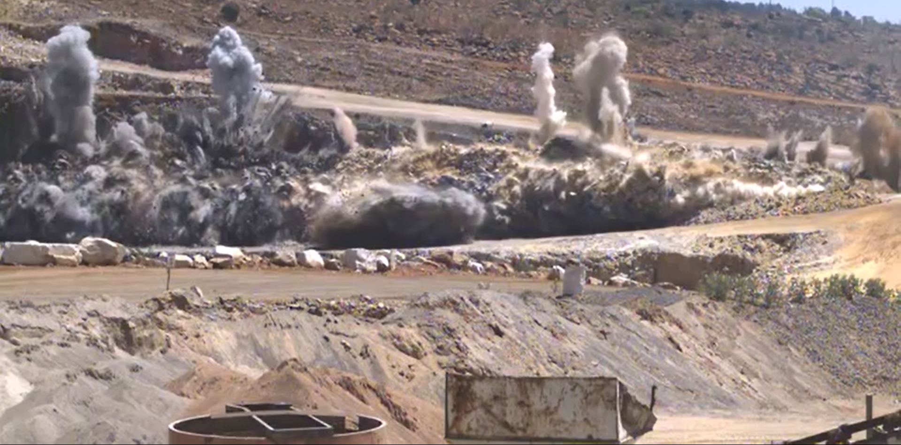
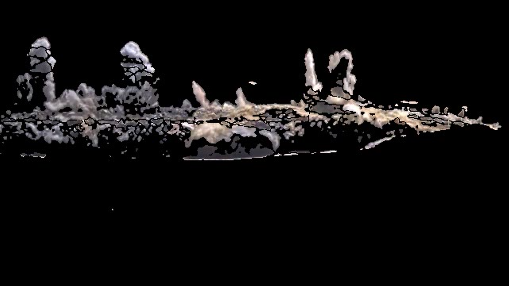
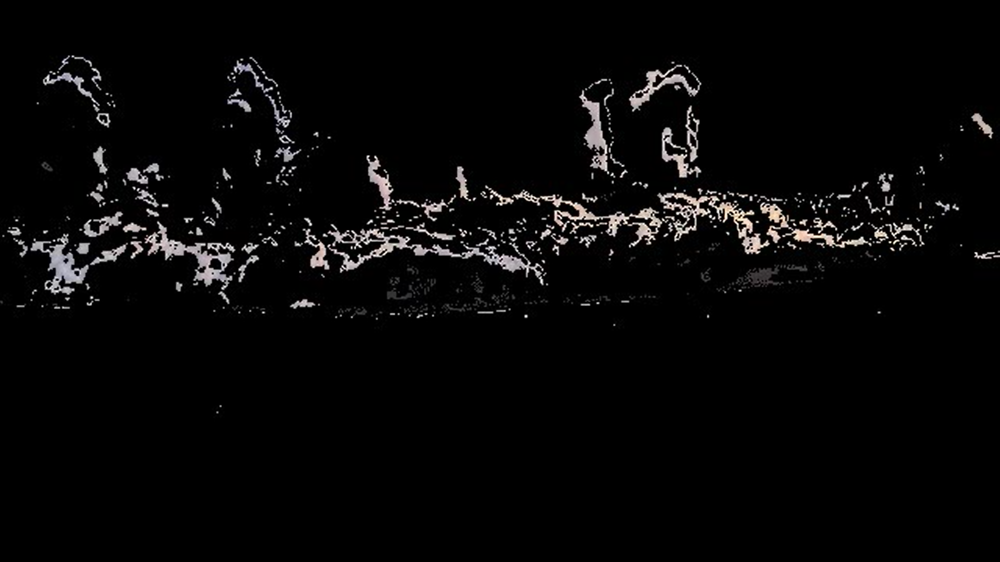

# fume-analysis-image-processing

Fume Analysis is a key check used by mining engineers while blasting. It focuses on checking specific fumes which are toxic in nature, This is a image processing / computer vision approach to filter and find percentage of these toxic fumes based on colors

This is a standard usecase and can be used to filter any moving object in a stabilised camera with consistent camera position.

Following is a series of snap showing the three phases (Raw | Background Subtraction | Harmful Fume Subtraction)



**Prequisites:**

1. Python3.7
2. If Docker Approach is selcted:
   1. Docker
   2. Docker Compose

The program can run in either of the two following ways:

1. Running the python file directly by passing the video url with the python file:

   ```
   pip install -r requirements.txt
   ```

   ```
   python fume_detect_extract_classify.py --vid {vid_path}
   ```
2. I've also made it as a complete dockerized server with proper authentication.
   Following is the way to run the dockerized version:

   ```
   cd dockerized_flask_container
   ```

   ```
   sudo docker-compose build
   ```

   ```
   sudo docker-compose up
   ```

*Resource Chart for Rest API:*

| Resources | URL       | Method | Param | Status                                                                     | Param Body type |
| --------- | --------- | ------ | ----- | -------------------------------------------------------------------------- | --------------- |
| Register  | /register | post   | uname, pass | 200 OK, 301 username already exist                                         | JSON |
| Classify  | /classify | post   | uname, pass, video_file | 200 OK, 301, 302 Incorrect id or pass, 303 Out of token, 304 Invalid input | Form |

*Database.ini:*

I have used a public database but you can replace it with your credentials in the **web/req_files/database.ini** file
